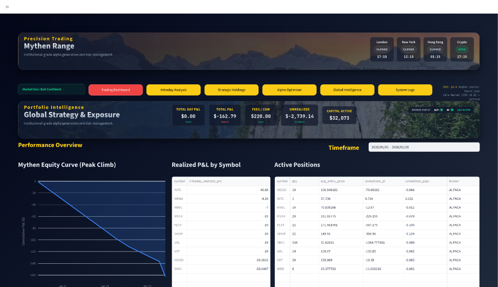
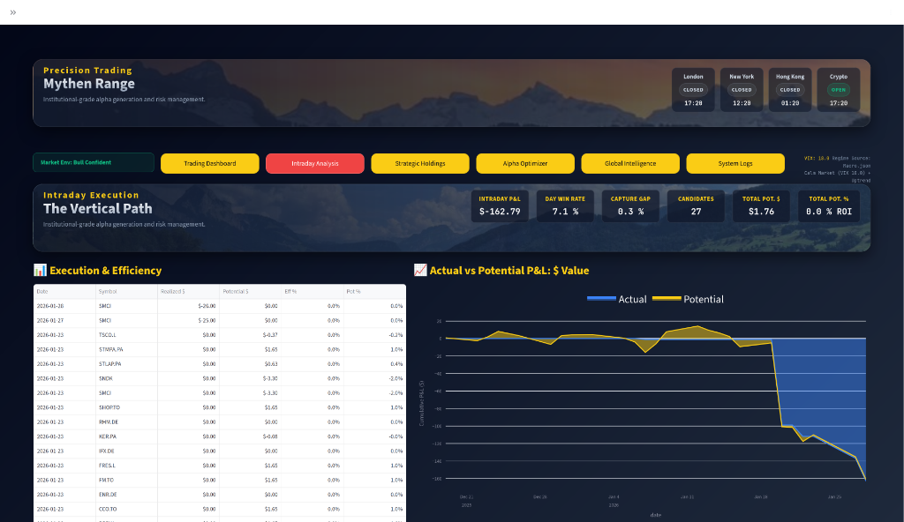
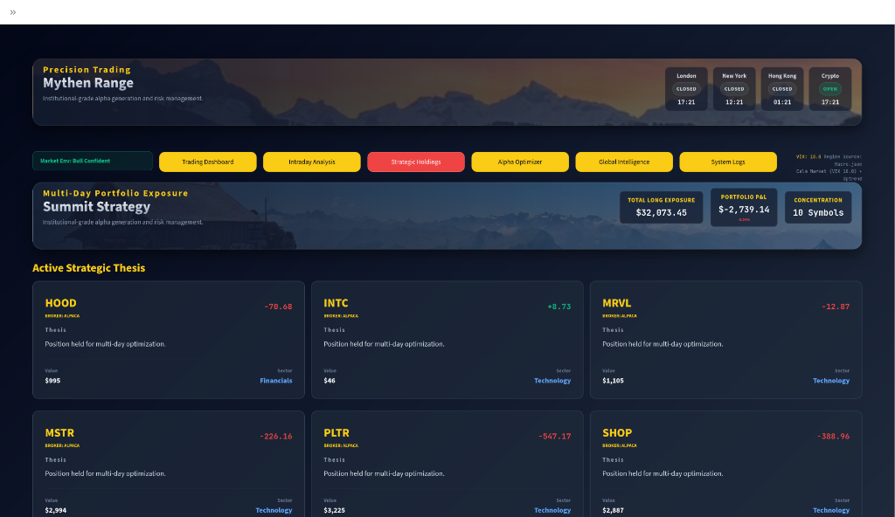
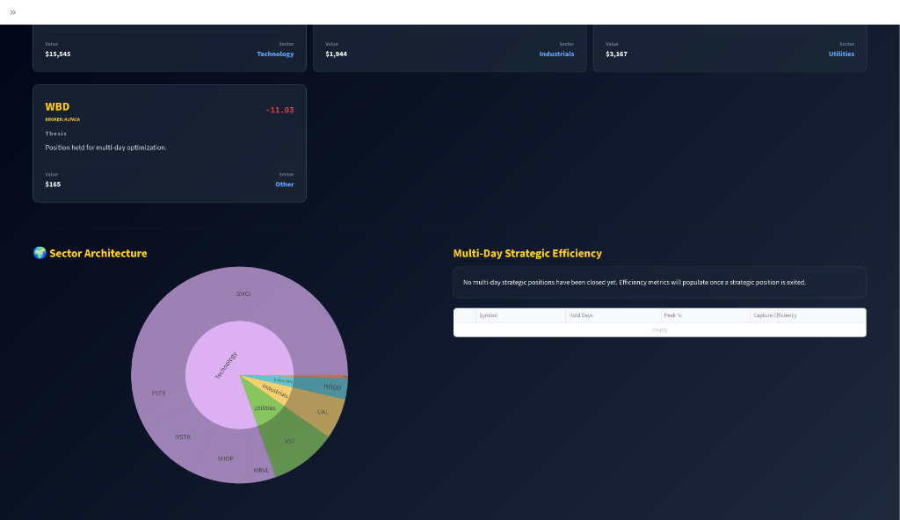
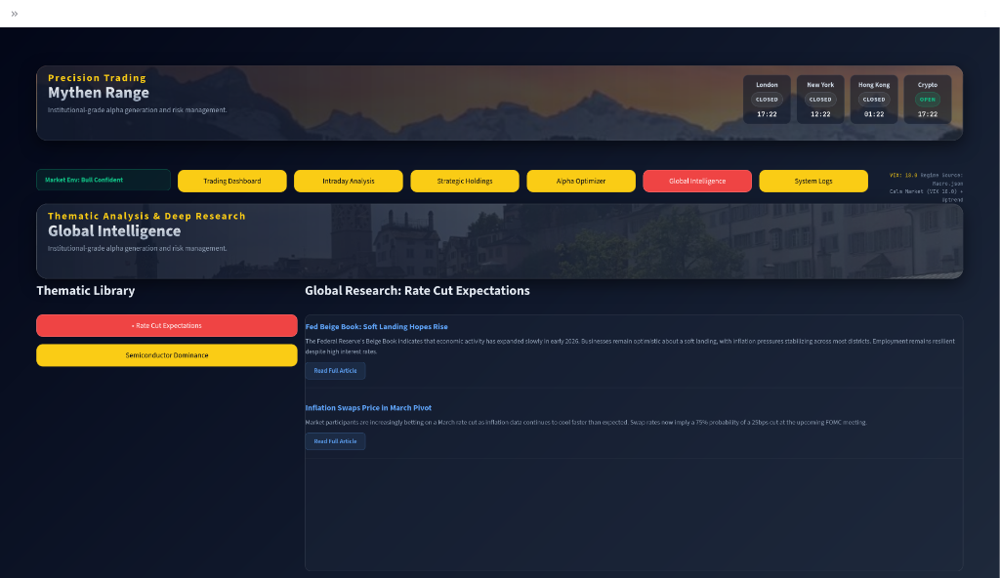
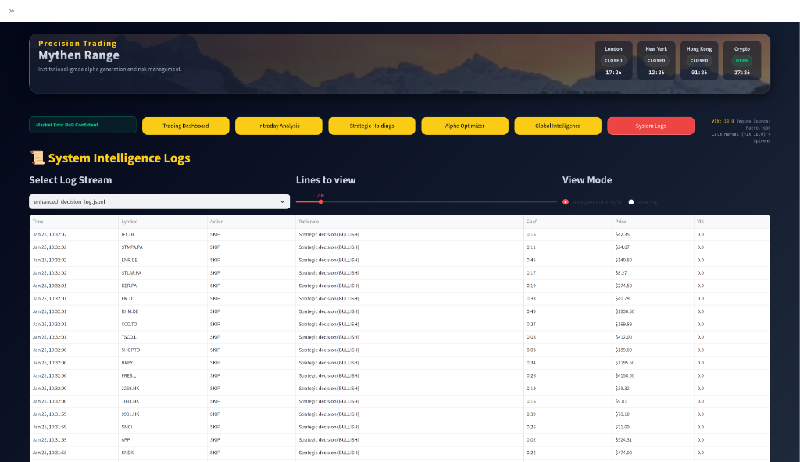
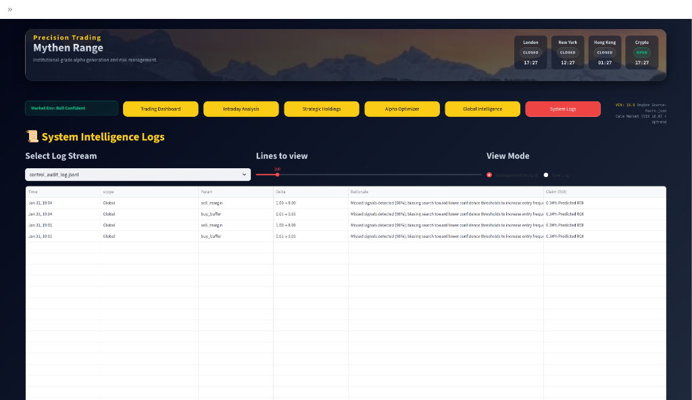
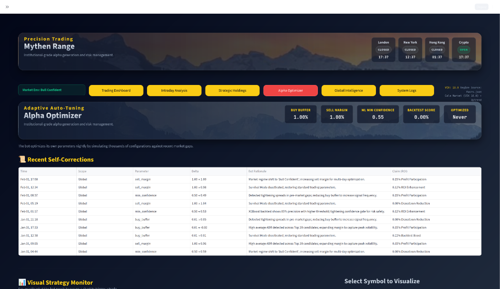

# RSI-MACD Trading Bot (Phase 3)

A fully autonomous, machine-learning-enhanced trading system designed for consistent profitability in US and Global markets. This system leverages technical analysis (RSI/MACD), XGBoost confidence gating, and a VIX-based Survival Mode.

## 🚀 Key Features (Phase 3.5)
- **3-Tier Orchestration (VM-Local)**: Modular separation of Daily Prep (T1), Intraday Execution (T2), and AI Intelligence (T3). Now running locally on VM to save costs.
- **Accelerated Learning Universe (ALU)**: Nightly hindsight analysis of 50 global symbols to rapidly scale ML experience without increasing capital risk.
- **Survival Mode**: Automated macro circuit breaker (VIX > 40) that halts buys and shifts to defensive postures.
- **Fee-Aware Sizing**: Minimum Viable Capital (MVC) logic to ensure trades remain profitable after commissions.
- **Cloud Archiving**: Automated monthly data shipping to Google Drive via `rclone`.
- **Management Insight**: High-fidelity JSONL decision logs displayed in a premium Streamlit dashboard.
- **Multi-Broker**: Unified routing for Alpaca (US), IBKR (Global), and Crypto.
- **Sentinel SRE & AI Agent**: Autonomous health monitoring and "Self-Healing" agent that identifies gaps, generates fixes, and **automatically applies code repairs** overnight via a secure VM-to-GitHub pipeline. The `ai-agent` also handles VM-to-GHA coordination for resource-intensive builds.

## 📂 Documentation Hub
For detailed guides, please refer to the `docs/` folder:

| Section | Link |
| :--- | :--- |
| **Start Here** | [Master Design Document](docs/index.md) |
| **Vision & Goals** | [Product Requirements (PRD)](docs/prd.md) |
| **Architecture** | [3-Tier System Architecture](docs/system_architecture.md) |
| **Deployment** | [DevOps & Infrastructure Guide](docs/devops_guide.md) |
| **Operations** | [Support & Maintenance Guide](docs/maintenance_guide.md) |
| **Portfolio** | [Visual Showcase & AI Residency](#-visual-portfolio--ai-residency) |

## 🖼️ Visual Portfolio & AI Residency

This project is a flagship demonstration of **AI Residency (AIR)** — the next-generation skill of architecting and orchestrating multiple AI agents to build and maintain production-grade systems. 

The following evidence highlights the technical depth and operational transparency achieved through this human-agent partnership.

````carousel

**Control Center**: The multi-broker dashboard provides a high-level view of portfolio intelligence, equity curves, and real-time P&L tracking across Alpaca and IBKR.
<!-- slide -->

**Performance Audit**: Detailed performance analysis comparing **Actual vs. Potential P&L**. This section measures the "Capture Gap" — proving execution efficiency against a feasible best-case simulation.
<!-- slide -->

**Strategic Logic**: The bot manages multi-day positions with auto-generated "Theses," ensuring every trade has a documented rationale for long-term optimization.
<!-- slide -->

**Risk Management**: Portfolio concentration and sector-level performance metrics ensure the bot maintains a balanced, diversified exposure automatically.
<!-- slide -->

**AI Research Layer**: Powered by LLMs, this tier scans macro sentiments and global news to identify emerging themes, allowing the system to pivot its bias based on live research.
<!-- slide -->

**Decision Transparency**: Full auditability. Every decision to BUY, SELL, or SKIP is logged with a detailed rationale and confidence score for 100% accountability.
<!-- slide -->

**Tactical Edge**: Visualizing relative strength across major market sectors to guide the bot's tactical rotation and allocation strategy.
<!-- slide -->

**Autonomous Evolution**: Evidence of nightly self-tuning. The bot logs its own parameter adjustments (margins, buffers) based on simulated market gaps.
<!-- slide -->

**Closed-Loop Learning**: The Alpha Optimizer screen showing the bot's ability to learn from recent performance and adjust its operational plan for maximum ROCE.
````

### � The "AI Residency" Approach
Unlike traditional development, this bot was built using **Agentic Orchestration**. As the Human Operator, I acted as the "Digital Architect," guiding multiple AI agents to solve complex engineering challenges:
- **Collaborative Architecture**: Designing the 3-Tier separation of concerns through iterative AI dialogue.
- **Bug-Squashing & Evolution**: Rapidly identifying edge cases (like multi-index data mapping) and implementing fixes in minutes.
- **Systemic Integration**: Managing the connection between XGBoost models, Flask APIs, and Streamlit front-ends as a unified product vision.

*This project is evidence of my ability to lead AI-augmented workflows in any high-stakes environment.*

## 🛠️ Quick Start
1. **Environment Setup**:
   ```bash
   cp .env.example .env  # Configure your API keys
   pip install -r requirements.txt
   ```
   
2. **Vertex AI Setup** (Required for AI features):
   - Follow the [Vertex AI Setup Guide](docs/vertex_ai_setup.md) to configure Google Cloud credentials
   - This enables Sentinel agent, news analysis, and strategic AI features

3. **Local Dashboard**:
   ```bash
   streamlit run app.py
   ```
4. **Docker Deployment**:
   ```bash
   ```
   
## 🚀 Deployment Workflow (The "Gold Standard")

We follow a strict **Local → GitHub → VM** workflow to ensure consistency and reliability.

### 1. Code Changes (Local)
*   **Action**: Edit code, update configurations, or modify prompts locally.
*   **Command**:
    ```bash
    git add .
    git commit -m "feat: description of changes"
    git push origin main
    ```
*   **Result**: GitHub Actions automatically builds the Docker images and pushes them to the registry. **Watchman** or **Cron** on the VM pulls these new images and restarts the containers.

### 2. Configuration Changes (VM)
*   **Scope**: Only for environment variables (`.env`) or one-off maintenance scripts not tracked in git.
*   **Action**: SSH into the VM and edit files directly.
    ```bash
    nano .env
    # Restart containers to apply env changes
    docker compose up -d
    ```

### 3. Autonomous Repair (Healer)
*   **Source**: The **Healer Agent** on the VM identifies a fix.
*   **Action**: 
    1. Healer applies the fix to a new git branch.
    2. Healer validates syntax and auto-merges to `main` (if `can_auto_apply: true`).
    3. Healer pushes the change to GitHub.
*   **Result**: The loop closes. You (the human) `git pull` locally to see the fix that the bot wrote for itself.

### ⚠️ IMPORTANT: Avoid Manual Processes
**Do not** run long-lived processes (like `streamlit run ...` or `python3 trading_bot.py`) manually on the VM using `nohup` or `screen`.
*   **Why?**: These manual processes block network ports (e.g., 8501) and prevent the automated Docker deployment from starting.
*   **Fix**: If you accidentally start a manual process, kill it:
    ```bash
    pkill -f streamlit
    docker compose up -d
    ```

## 📊 Operational Flow (VM-Local Cron)
The bot operates in a daily cycle managed by the `DailyOrchestrator` running directly on the Hetzner VM:
1. **Post-Market (22:30 UTC)**: Performance audit, Sentinel strategic pulse, and Healer auto-repair sequence.
2. **Pre-London (07:00 UTC)**: Candidate filtering and overnight analysis refresh for EMEA/UK.
3. **Pre-New York (13:30 UTC)**: Final candidate selection and XGBoost retraining for the US open.
4. **Intraday**: Continuous execution via the `IntradayOrchestrator` on the VM.
5. **Self-Healing Window**: Auto-fixes are applied between 21:00 - 01:30 UTC during the Deep Silence period.

## 🧼 VM Maintenance & Disk Hygiene

The Hetzner VM has a 40GB disk. To prevent "No space left on device" errors during deployment, follow these practices:

1.  **Automated Pruning**: The deployment script now uses `--no-cache` and sequential builds to minimize peak disk usage.
2.  **Manual Cleanup**: If the build fails due to disk space, run:
    ```bash
    docker system prune -a -f
    ```
    This removes all unused images, containers, and build cache, typically reclaiming 5-15GB.
3.  **Logs**: Logs are automatically rotated, but large logs in `/app/logs` can be cleared if necessary.

---
*Developed for Advanced Agentic Trading.*
