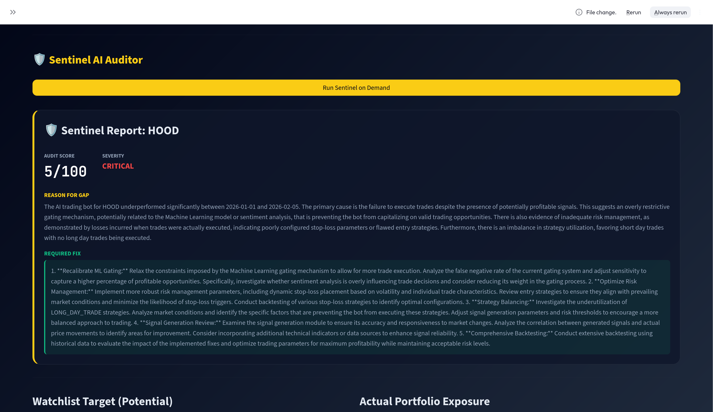

> [!NOTE]
> **Portfolio Mirror**: This repository contains the public-facing documentation, architecture, and visual evidence for the RSI-MACD Trading Bot. The core execution engine and proprietary trading strategies are maintained in a secure, private repository.

# RSI-MACD Trading Bot (Phase 3)

A fully autonomous, machine-learning-enhanced trading system designed for consistent profitability in US and Global markets. This system leverages technical analysis (RSI/MACD), XGBoost confidence gating, and a VIX-based Survival Mode.

## 🚀 Key Features (Phase 3)
- **3-Tier Orchestration**: Modular separation of Daily Prep (T1), Intraday Execution (T2), and AI Intelligence (T3).
- **Accelerated Learning Universe (ALU)**: Nightly hindsight analysis of 50 global symbols to rapidly scale ML experience without increasing capital risk.
- **Survival Mode**: Automated macro circuit breaker (VIX > 40) that halts buys and shifts to defensive postures.
- **Adaptive Risk Management**: Dynamic VOLATILE mode that prioritizes high-confidence technical signals (>0.85) over macro caution in volatile conditions.
- **Conviction-Based Sizing**: Order sizes scale from 0.5x to 2.0x based on ML confidence with ADR dampening for volatility control.
- **Short-Selling Protocol**: Risk-guarded short selling with 4% hard stop-loss, whitelisted symbols (AAPL, TSLA, NVDA, META, HOOD, etc.), and 0.5% max position sizing.
- **The Runner**: Staged profit-taking protocol with partial exits at 2%, 5%, and 10% gains, plus adaptive trailing stops.
- **Fee-Aware Sizing**: Minimum Viable Capital (MVC) logic to ensure trades remain profitable after commissions.
- **Cloud Archiving**: Automated monthly data shipping to Google Drive via `rclone`.
- **Management Insight**: High-fidelity JSONL decision logs displayed in a premium Streamlit dashboard.
- **Multi-Broker**: Unified routing for Alpaca (US), IBKR (Global), and Crypto.
- **Sentinel SRE**: Autonomous health monitoring and **Self-Healing Loop** that audits trading strategy and automatically generates technical fixes.
    - **Nightly Pulse**: Runs automatically after market close via `daily_orchestrator.py`
    - **Manual Run**:
        ```bash
        python agent/sentinel_agent.py
        ```
    - **Self-Healing**: Integrated `HealerAgent` translates strategic findings into technical directives, which are autonomously applied to fix gating issues, weight adjustments, and threshold tuning.
    - **Direct Feedback**: The agent writes to `config/sentinel_directive.json`. The bot reads this to perform "Strategic Resets" or adjust confidence floors mid-day.
    - **Strategy Auditing**: If the Sentinel flags "Strategic Stagnation," it means the bot's parameter tuning is not producing trades. Review `logs/control_audit_log.jsonl` for details.

## 📂 Documentation Hub
For detailed guides on the architecture and product vision, please refer to the `docs/` folder:

| Section | Link |
| :--- | :--- |
| **Start Here** | [Master Design Document](docs/index.md) |
| **Vision & Goals** | [Product Requirements (PRD)](docs/prd.md) |
| **Architecture** | [3-Tier System Architecture](docs/system_architecture.md) |
| **Deployment** | [DevOps & Infrastructure Guide](docs/devops_guide.md) |
| **Operations** | [Support & Maintenance Guide](docs/maintenance_guide.md) |
| **Portfolio** | [Visual Showcase & AI Residency](#-visual-portfolio--ai-residency) |

## 🖼️ Visual Portfolio & AI Residency

This project is a flagship demonstration of **AI Residency (AIR)** — the next-generation skill of architecting and orchestrating multiple AI agents to build and maintain production-grade systems. 

The following evidence highlights the technical depth and operational transparency achieved through this human-agent partnership.

### 🖥️ Platform Showcase

#### 01 - Control Center: Global Strategy & Exposure

*The multi-broker dashboard provides a high-level view of portfolio intelligence, equity curves, and real-time P&L tracking across Alpaca and IBKR.*

#### 02 - Performance Audit: Intraday Execution Map

*Detailed performance analysis comparing **Actual vs. Potential P&L**. This section measures the "Capture Gap" — proving execution efficiency against a feasible best-case simulation.*

#### 03 - Strategic Logic: Multi-Day Thesis

*The bot manages multi-day positions with auto-generated "Theses," ensuring every trade has a documented rationale for long-term optimization.*

#### 04 - Risk Management: Sector Architecture

*Portfolio concentration and sector-level performance metrics ensure the bot maintains a balanced, diversified exposure automatically.*

#### 05 - AI Research Layer: Thematic Research

*Powered by LLMs, this tier scans macro sentiments and global news to identify emerging themes, allowing the system to pivot its bias based on live research.*

#### 06 - Transparency: Management Insight Logs

*Full auditability. Every decision to BUY, SELL, or SKIP is logged with a detailed rationale for 100% accountability.*

#### 07 - Tactical Edge: Sector Rotation

*Visualizing relative strength across major market sectors to guide tactical rotation and allocation.*

#### 08 - Autonomous Evolution: Control Audit Logs

*Evidence of nightly self-tuning. The bot logs its own parameter adjustments (margins, buffers) based on simulated market gaps.*

#### 09 - Continuous Learning: Alpha Optimizer

*The Alpha Optimizer screen showing the bot's ability to learn from recent performance and adjust its operational plan.*

#### 10 - Sentinel AI Auditor: Self-Healing Loop

*The Sentinel AI Auditor autonomously reviews trading performance, identifies strategic gaps, and generates technical fixes. This "Self-Healing Loop" enables the bot to repair its own code based on missed opportunities, ensuring continuous improvement without human intervention.*

### 🚀 The "AI Residency" Approach
Unlike traditional development, this bot was built using **Agentic Orchestration**. As the Human Operator, I acted as the "Digital Architect," guiding multiple AI agents to solve complex engineering challenges:
- **Collaborative Architecture**: Designing the 3-Tier separation of concerns through iterative AI dialogue.
- **Bug-Squashing & Evolution**: Rapidly identifying edge cases (like multi-index data mapping) and implementing fixes in minutes.
- **Systemic Integration**: Managing the connection between XGBoost models, Flask APIs, and Streamlit front-ends as a unified product vision.

*This project is evidence of my ability to lead AI-augmented workflows in any high-stakes environment.*

## 📈 Operational Status
The bot currently operates in a daily cycle:
1. **08:00 EST**: Ingestion of 50 global candidates, Accelerated Learning hindsight analysis, and retraining of XGBoost confidence gates.
2. **09:30 EST**: Deployment of the Intraday trading loop.
3. **16:00 EST**: Automated P&L settlement and risk reporting.
4. **17:00 EST**: 
   - **Sentinel Pulse**: Nightly audit of missed opportunities and strategic failures
   - **Healer Pulse**: Autonomous generation of technical fixes based on Sentinel findings
   - Cloud archiving of high-fidelity decision logs

---
*Developed for Advanced Agentic Trading.*
