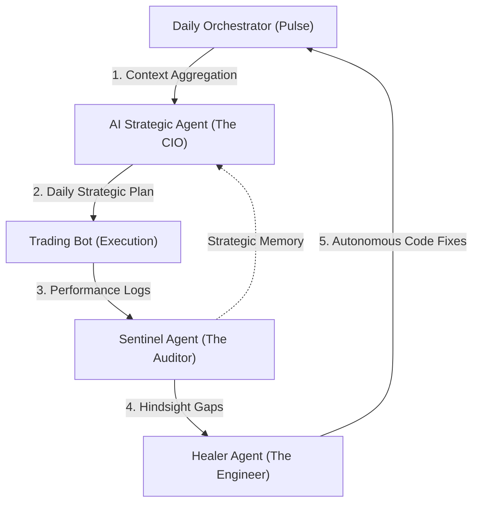

# Agentic AI Architectural Roadmap

This document outlines the end-to-end "Intelligence Loop" of the Trading Bot. It demonstrates how the system moves from raw data to strategic planning, autonomous execution, and self-healing.

## The Intelligence Loop

The bot operates on a four-stage recursive cycle. Every night, it reflects on yesterday's failures to plan for today's success.

---

## Phase 1: Strategic Planning (The CIO)
**File**: [ai_strategic_agent.py](file:///home/gary/rsi-macd-bot/trading_bot/core/ai_strategic_agent.py)

The loop begins in `daily_orchestrator.py` calling `run_strategic_analysis()`. 
- **Goal**: To set a concrete "Objective of the Day" rather than trading statically.
- **Inputs**: 
    - Macro Regime (e.g., BULL_CONFIDENT vs. SYSTEMIC_CRASH).
    - News Sentiment & Thematic Drivers.
    - **Sentinel Directives**: Hindsight feedback from previous failures.
- **Output**: `data/strategic_plan.json` containing specific symbol recommendations, risk multipliers, and capital allocation.

## Phase 2: Autonomous Execution
**File**: [trading_bot.py](file:///home/gary/rsi-macd-bot/trading_bot/core/trading_bot.py)

The bot loads the strategic plan at the start of the session.
- **Dynamic Risk**: It adjusts stop-losses based on the CIO's `risk_multiplier`.
- **Priority Weights**: It prioritizes symbols tagged as "High Conviction" by the AI.

## Phase 3: Hindsight Audit (The Sentinel)
**File**: [sentinel_agent.py](file:///home/gary/rsi-macd-bot/agent/sentinel_agent.py)

After the markets close, the Sentinel runs a "Post-Mortem."
- **Marking the Homework**: It compares actual trades to theoretical "Perfect Trades" (Hindsight).
- **Gap Analysis**: If the bot missed a 2% swing, the Sentinel identifies *why* (e.g., "The stop-loss was too tight for this volatility").
- **Output**: `data/sentinel_feedback.json` explaining the gap and the required fix.

## Phase 4: Self-Healing (The Healer)
**File**: [healer_agent.py](file:///home/gary/rsi-macd-bot/agent/healer_agent.py)

The Healer takes the Sentinel's audit and turns it into reality.
- **Translation**: It converts a strategic instruction (e.g., "Loosen stops on NVDA") into technical directives.
- **Action**: It autonomously modifies code in `trading_config.json` or core logic files, creates a git branch, and validates syntax.
- **Auto-Merge**: In Phase 2, it can even push these fixes to the main branch for the next Orchestrator run.

---

## The Shadow Feedback Loop (ML Improvement)
**File**: [train_mi_model.py](file:///home/gary/rsi-macd-bot/ml_pipeline/training/train_mi_model.py)

Beyond the agents, the ML models also self-improve:
- **Reward Function**: The model is retrained using `--use-perfect-trades`. 
- **Objective**: It doesn't just learn from what happened; it learns from what *should* have happened (Hindsight Learning).

---

## How to Contribute via Gap Analysis

To improve performance, focus on the "Gaps" identified by the Sentinel:
1.  **Check the Audit**: View `logs/sentinel_activity.jsonl` to see where the bot is "marking itself down."
2.  **Adjust the Prompt**: If the `AIStrategicAgent` is making poor allocations, refine the CIO prompt in `ai_strategic_agent.py`.
3.  **Tweak the Healer**: If the bot identifies a gap but can't fix it, add a new "Technical Translation" rule to `healer_agent.py`.

> [!TIP]
> Use the `/performance-audit` workflow to see a visual representation of these gaps in the Portfolio Dashboard.
