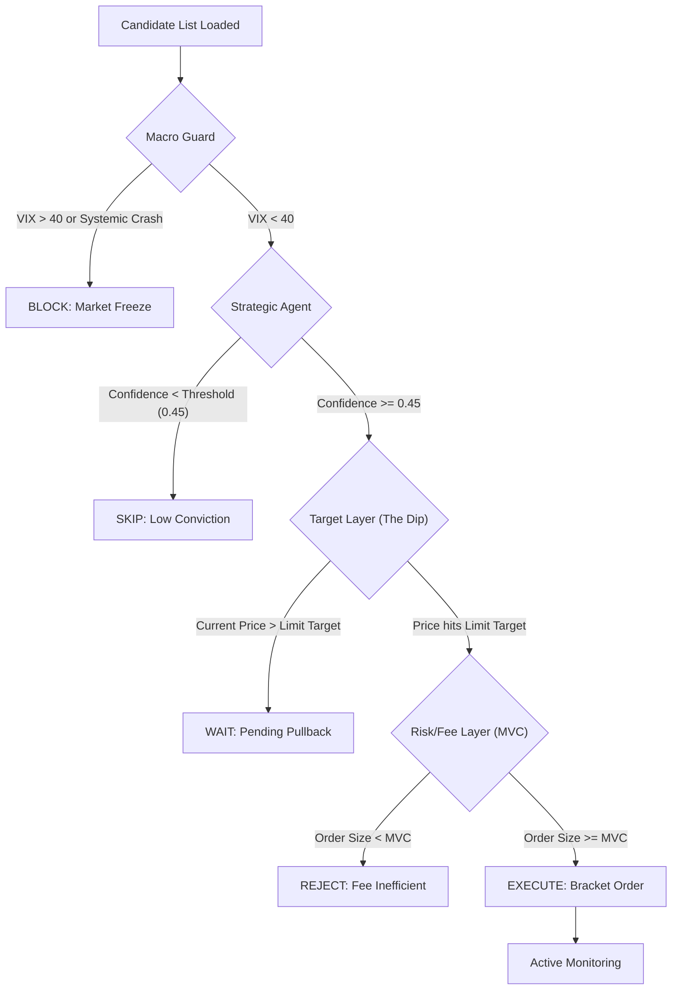

# Bot Intelligence Decision Tree: From Candidate to Profit

This document outlines the end-to-end lifecycle of a stock ticker within the rsi-macd-bot, detailing the logic gates and threshold criteria that determine if a trade is executed and how it is managed.

## 1. Phase 1: Selection (The "Draft")
**Trigger**: Daily/Overnight Orchestrator
**Script**: `weekly_analysis/find_top_day_trading_candidates.py`

| Step | Input | Threshold / Logic | Output |
| :--- | :--- | :--- | :--- |
| **Scan** | `all_symbols.txt` | Filters for volume and availability. | Universe of tradable stocks. |
| **Ranking** | YFinance Daily Data | Sorts by **ADR %** (Average Daily Range) over last 20 days. | Ranked list. |
| **Selection** | Sorted List | Takes Top 20 symbols with highest volatility. | `top_20_day_trading_candidates.csv` |

---

## 2. Phase 2: Live Processing (The "Live Gating")
**Trigger**: Trading Bot Main Loop
**Component**: `TradingBot.run()`

### Decision Tree Flow

### Key Logic Gates

#### A. Strategic Agent (`_calculate_strategic_score`)
*   **Purpose**: Determines if the "Vibe" is right for a trade.
*   **Inputs**: Sentiment data, Technicals (RSI/MACD), Sector Rotation.
*   **Threshold**: `min_confidence` (default: 0.45).
*   **Reasoning**: If the score is low, the bot assumes it's "catching a falling knife" and skips.

#### B. Target Layer (`calculate_buy_sell_targets`)
*   **Purpose**: Calculates the **Limit Entry** price.
*   **Logic (Current)**: Uses a static "Buffer" based on Market Regime.
    *   **Bull**: entry = Current * (1 - 0.02%)
    *   **Caution**: entry = Current * (1 - 0.50%)
*   **Optimization (Planned)**: Replace static 0.5% with **ADR-Relative Pullbacks** (e.g., 10% of Daily Range) + **VSA Lift/Drag**. If VSA shows "Stopping Volume", we buy higher (0.1% dip) to ensure fill.

#### C. Volume/Momentum Layers (The "Engine Room")
*   **VSA (Volume Spread Analysis)**: Detects professional activity (Absorption/Supply Tests).
*   **RSI/MACD**: Measures trend momentum.
*   **Planned Integration**: These will now feed back into the Strategic Score AND the Target Price to prevent buying "dead" stocks or missing "launching" ones.

#### C. Fee Efficiency Gate (MVC)
*   **Purpose**: Ensures commissions don't eat all profits.
*   **Formula**: `(Quantity * Price) * Expected_Move_Pct > 5x to 10x Commission`.
*   **Threshold**: Typically $2,000 for stocks with 1% volatility on IBKR.

---

## 3. Phase 3: Active Management (The "Harvest")
**Trigger**: `ExitEvaluator` (Every minute)

| Exit Type | Logic | Threshold |
| :--- | :--- | :--- |
| **Big Bang** | Fixed Limit Order | 1.5x ADR (e.g., +6% target) |
| **Harvest** | Adaptive Trailing Stop | Triggers at ~15% of ADR move. retraces at 5% of ADR. |
| **Hard Stop** | Stop Loss | 2% from entry or 75% of ADR. |
| **End of Day** | Time-based Close | 15:55 ET (if configured to avoid PDT). |

---

## Analysis: Could we do better?

### Current Weaknesses
1.  **Static Dip Buffers**: Waiting for a flat 0.5% dip on a stock that only moves 1% a day is very different from waiting for 0.5% on a stock that moves 8%.
2.  **Disconnected Logic**: The Strategic Agent might be "Bullish," but the Target Layer is in "Caution" mode, creating a logic mismatch.
3.  **Connection Reliance**: If the bot disconnects, it relies on the "Big Bang" 6% target, which might be too optimistic, causing a winner to turn into a loser.

### Proposed Optimizations
1.  **ADR-Relative Entry**: Wait for a dip equal to **10% of the ADR**, not a flat percentage.
2.  **Sentiment-Aware Entry**: If Strategy Score is > 0.8 (Extreme Bullish), skip the dip and buy at Market.
3.  **VSA-Enhanced Targets**: Use Volume Climax signals to adjust the "Big Bang" target down before a reversal happens.
