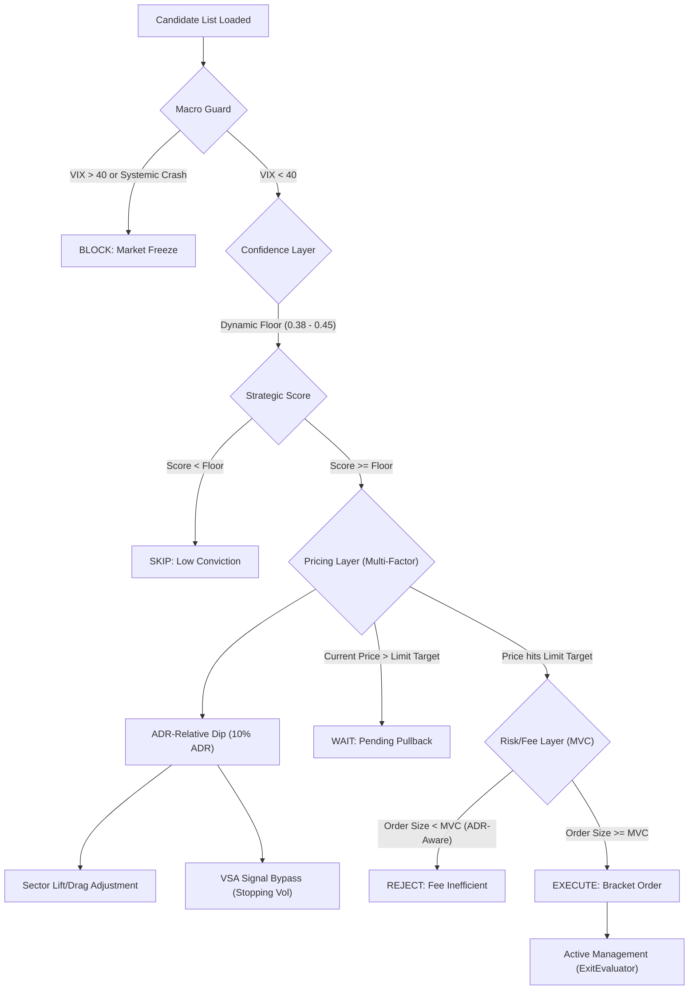

# Bot Intelligence Decision Tree: From Candidate to Profit

This document outlines the end-to-end lifecycle of a stock ticker within the rsi-macd-bot, detailing the logic gates and threshold criteria that determine if a trade is executed and how it is managed.

## 1. Phase 1: Selection (The "Draft")
**Trigger**: Daily/Overnight Orchestrator
**Script**: `weekly_analysis/find_top_day_trading_candidates.py`

| Step | Input | Threshold / Logic | Output |
| :--- | :--- | :--- | :--- |
| **Scan** | `all_symbols.txt` | Filters for volume and availability. | Universe of tradable stocks. |
| **Ranking** | YFinance Daily Data | Sorts by **ADR %** (Average Daily Range) over last 20 days. | Ranked list. |
| **Selection** | Sorted List | Takes Top 20 symbols with highest volatility. | `top_20_day_trading_candidates.csv` |

---

## 2. Phase 2: Live Processing (The "Live Gating")
**Trigger**: Trading Bot Main Loop
**Component**: `TradingBot.run()`

### Decision Tree Flow

### Key Logic Gates

#### A. Confidence Layer & Dynamic Scaling
*   **Purpose**: Adjusts the "selectivity" of the bot based on broad market volatility.
*   **Logic**: During high VIX environments, naturally occurring sentiment and technical scores drop. To prevent total bot paralysis, the floor scales:
    *   **VIX < 21**: Floor = 0.45 (Standard)
    *   **VIX 21 - 27**: Floor = 0.42 (Moderate)
    *   **VIX > 27**: Floor = 0.38 (Volatile)

#### B. Multi-Factor Pricing (`calculate_buy_sell_targets`)
*   **Purpose**: Sets the precise **Limit Entry** and **Big Bang** targets.
*   **Logic**:
    *   **Entry Base**: Pullback target is set to **10% of the stock's ADR**.
    *   **Sector Lift**: If the sector is leading (Score > 0.03), entry is moved up by 50% to ensure fill.
    *   **VSA Bullishness**: If professional accumulation (Stopping Volume) is detected, the bot bypasses the dip requirement for near-market entry.
    *   **Regime Multipliers**: Dips are expanded in Bear markets (2.0x) and tightened in Bull markets (0.2x).

#### C. Fee Efficiency Gate (MVC)
*   **Purpose**: Ensures commissions or FX fees don't eat more than 10% of the expected move.
*   **Formula**: `MVC = Total Commissions / (ADR% * Net Profit Margin%)`.
*   **Benefit**: This gate is now **ADR-Aware**. Volatile stocks have a lower dollar-minimum requirement than stable ones.

---

## 3. Phase 3: Active Management (The "Harvest")
**Trigger**: `ExitEvaluator` (Every minute)

| Exit Type | Logic | Threshold |
| :--- | :--- | :--- |
| **Big Bang** | Dynamic Limit Order | **1.5x ADR** (Default) |
| **VSA Climax** | Bearish Absorption Detection | Tightens "Big Bang" target by **50%** for immediate harvest. |
| **Harvest** | Adaptive Trailing Stop | Triggers at **15% of ADR** move, trails at **5% of ADR**. |
| **Vol-Aware Stop** | Dynamic Stop Loss | Sets at **75% of ADR** from entry (min 2.0%). |
| **End of Day** | Time-based Close | 15:55 ET for US markers / Market-specific for Intl. |

---

## 4. Operational Guardrails

### Systemic Crash Protection
The `MacroAnalyzer` continuously monitors for systemic crashes. If detected, the `macro_regime` is set to `SYSTEMIC_CRASH`, which globally blocks all new entries regardless of candidate strength.

### Indicator Anchoring
For low-volatility stocks (ADR < 2.5%), the pricing engine anchors targets to major technical levels (SMA 20, 50, 200) if they are within 1% of the calculated price, improving the probability of fill at clear support/resistance.
