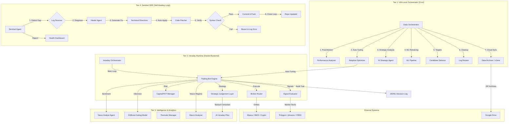

# System Architecture Document

## 1. Overview
The Trading Bot follows a **3-Tier Orchestrated Architecture** designed for high modularity, advanced risk management (Survival Mode), and automated data lifecycle management (Cloud Archiving).

## 2. Component Diagram

## 3. Data Flows
62: 1.  **Overnight Prep (T1 - VM Local)**:
63:     - **Automation**: Triggered via VM-local Cron jobs to save GitHub Action minutes.
64:     - **Post-Mortem**: Analyzes yesterday's trades to find "Efficiency Gaps".
    - **Optimization**: Retunes RSI/MACD parameters based on recent performance.
    - **Strategic Agent**: Generates a high-level `strategic_plan.json` (Risk Multiplier & Bias).
    - **Training**: Retrains XGBoost on new outcomes.
2.  **Market Execution (T2)**:
    - **Live Learning (Agility)**: `TradingBot` performs `_reload_config()` per loop to pick up Tier 1 optimizations (Adaptive Optimizer) without restart.
    - **Signals**: Bot calculates tech indicators and fetches macro regime via `MacroAnalyzer`.
    - **Sizing**: `CapitalAllocationManager` applies fee-aware sizing (MVC). Track A trades are boosted only if ML Score >= 0.75.
    - **Survival**: If `VIX > 40`, the bot enters Survival Mode, blocking new buys.
    - **Exits**: `ExitEvaluator` consults the **AI Intraday Pilot** (T3) for tactical conviction. This allows the bot to widen trailing stops for "blow-off tops" or tighten them during trend stalling.
3.  **Archiving & Rotation**:
    - Rotated logs and historical CSVs are zipped and shipped to Google Drive monthly via `rclone`.

4.  **Autonomous Healing (T4)**:
    - **Sentinel Agent**: Periodically scans `trading_bot.log`, `orchestrator.log`, and `control_audit_log.jsonl`.
    - **Strategic Feedback**: Communicates directly with Tier 2 via `sentinel_feedback.json` to force parameter resets or adjust entry confidence floors when stagnation is detected.
    - **Healer Agent (Autonomous Repair)**:
        - **Directive Generation**: Translates Sentinel findings into actionable code-level directives.
        - **Auto-Execution Pipeline**: Executes approved directives (`can_auto_apply: true`) automatically during orchestrator runs.
        - **Closed-Loop Repair**: Changes are committed, pushed to the repository, and immediately active on the next run.
        - **Safety Mechanisms**: 
            - Git branch isolation (`healer/auto-fix-{SYMBOL}-{TIMESTAMP}`)
            - Python syntax validation prior to commit
            - Automatic rollback on failures
        - **Audit Trail**: Full traceability from detection to fix in `healer_history.jsonl`.

## 4. Service Boundaries
-   **Broker Router**: Unified interface for Alpaca (US), IBKR (Global), and CCXT (Crypto).
-   **Strategic Judgement Layer**: Decoupled module that combines ML scores, news sentiment, and macro bias. Includes **Strict Schema Gating** to block invalid data.
-   **Exit Evaluator**: Responsible for same-day and overnight exit logic, featuring trailing profit protection and PDT-optimized reversal exits.
-   **Decision Logger**: Thread-safe JSONL persistence for the "Management Insight" dashboard.
-   **Data Archiver**: Stateless wrapper around `rclone` for cloud synchronization.

## 5. Technology Stack
-   **Language**: Python 3.10+
-   **Infrastructure**: Hetzner Dedicated VM (Linux), Systemd (Process monitoring).
-   **Database**: SQLite (`capital_alloc.db`, `ml_features.db`), JSONL (Decision Audit).
-   **ML Framework**: XGBoost (Gating), Vertex AI/Gemini (News/Thematic Analysis, Sentinel Audits, Healer Auto-Repair).
-   **Broker APIs**: Alpaca-py, IBKR Gateway (Portal/API), CCXT.
-   **Utilities**: `rclone` (Cloud Sync), `zip` (Log bundling).

## 6. Deployment Topology
-   **Host**: Linux VM.
-   **Persistence**: Local `data/` and `logs/` volumes with monthly cloud offloading.
-   **Monitoring**: Streamlit Dashboard for real-time visibility into the "Brain" (Strategic Judgement).
