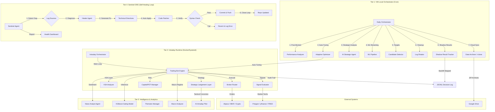

# System Architecture Document

## 1. Overview
The Trading Bot follows a **3-Tier Orchestrated Architecture** designed for high modularity, advanced risk management (Survival Mode), and automated data lifecycle management (Cloud Archiving).

## 2. Component Diagram

## 3. Data Flows
1.  **Orchestrated Prep (Push Architecture)**:
    - **Step 1: Data Fetch (GHA - 4x Daily)**: GitHub Action (`scheduled-orchestrator.yml`) runs at `06:30`, `12:30`, `17:30`, and `22:30` UTC. It fetches global market data (US, UK, HK), normalizes intraday series, and refreshes the symbol universe.
    - **Step 2: Sync & Trigger (GHA -> VM)**: After harvesting, GHA synchronization:
        - Uploads fresh historical CSVs (intraday raw data), JSON reports, and `all_symbols.txt`.
        - Syncs `data/.orchestrator_progress.json` to inform the VM of completed tasks.
        - Sends a remote SSH trigger to initiate the VM's execution phase.
    - **Step 3: Intelligence Execution & Freshness (VM)**: VM Orchestrator utilizes a **3-hour freshness threshold** (`MAX_DATA_AGE_HOURS=3`).
        - **Session Awareness**: The 3-hour limit ensures the HK Prep run (4.5h after US Midday) correctly identifies the previous session as stale, forcing fresh candidate discovery.
        - **Contingency / Fallback**: The VM maintains an active local crontab. If GHA fails to trigger or sync, the VM detects the data is stale (>3h) and automatically executes local harvesting/discovery.
        - **Intelligence Loop**: After ensuring fresh discovery, the VM executes Post-Mortem, AI Strategic Planning, and ML training.
2.  **Market Execution (T2)**:
    - **Live Learning (Agility)**: `TradingBot` performs `_reload_config()` per loop to pick up Tier 1 optimizations (Adaptive Optimizer) without restart.
    - **Signals**: Bot calculates tech indicators and fetches macro regime via `MacroAnalyzer`.
    - **Sizing**: `CapitalRiskManager` applies fee-aware sizing (MVC) and enforces dynamic portfolio/symbol exposure caps (e.g., 90% total / 10% per symbol) rather than hard position counts.
    - **Survival**: If `VIX > 40`, the bot enters Survival Mode, blocking new buys. 
    - **Downturn Protection (Phase 5)**: In Bearish/Volatile regimes, the bot automatically:
        - Buys **Protective Puts** to hedge existing long positions.
        - Sells **Covered Calls** for income.
        - Executes **Whitelisted Shorting** on highly liquid symbols (TSLA, NVDA, etc.) to profit from the drop.
    - **Exits**: `ExitEvaluator` consults the **AI Intraday Pilot** (T3) for tactical conviction.
    - **Opportunity Cost**: `ShadowResultTracker` (T1) monitors skipped trades in the decision log and backfills real-world outcomes to ensure the ML model can learn from missed opportunities.
3.  **Archiving & Rotation**:
    - Rotated logs and historical CSVs are zipped and shipped to Google Drive monthly via `rclone`.

4.  **Autonomous Healing (T4)**:
    - **Sentinel Agent**: Periodically scans `trading_bot.log`, `orchestrator.log`, and `enhanced_decision_log.jsonl` (specifically auditing for unfilled limit orders via `ShadowResultTracker`).
    - **Strategic Feedback**: Communicates directly with Tier 2 via `sentinel_feedback.json` to force parameter resets or adjust entry confidence floors when stagnation or execution failures are detected.
    - **Healer Agent (Autonomous Repair)**:
        - **Directive Generation**: Translates Sentinel findings into actionable code-level directives.
        - **Auto-Execution Pipeline**: Executes approved directives (`can_auto_apply: true`) automatically during orchestrator runs.
        - **Closed-Loop Repair**: Changes are committed, pushed to the repository, and immediately active on the next run.
        - **Safety Mechanisms**: 
            - Git branch isolation (`healer/auto-fix-{SYMBOL}-{TIMESTAMP}`)
            - Python syntax validation prior to commit
            - Automatic rollback on failures
        - **Audit Trail**: Full traceability from detection to fix in `healer_history.jsonl`.

## 4. Service Boundaries
-   **Broker Router**: Unified interface for Alpaca (US), IBKR (Global), and CCXT (Crypto). Normalizes outputs (e.g., parsing native account state into standard dictionaries) to prevent cross-API breaking changes. Incorporates multi-region time-of-day awareness (LSE, XETRA, SBF, HKEX, TSX) to autonomously gate trading execution per local market hours.
-   **Strategic Judgement Layer**: Decoupled module that combines ML scores, news sentiment, and macro bias. Includes **Strict Schema Gating** and **Volume Spread Analysis (VSA)** to block invalid data or confirm price action.
-   **Exit Evaluator**: Responsible for same-day and overnight exit logic. Features a **"Grip & Harvest" (ADR Capture)** strategy: 
    - **Ultra-Aggressive Entry**: Buy buffers as low as 0.02% to ensure execution.
    - **Dynamic Harvesting**: Targets 75% of the symbol's ADR move for profit taking.
    - **Big Bang Caps**: Sets 1.5x ADR limit orders as high-water mark protection.
    - **VSA Integration**: Detects **Buying Climax** and **Volume Divergence** for early profit protection before standard stops trigger.
    - **AI Pilot Integration**: Consults the AI Intraday Pilot for tactical conviction and trailing stop adjustments.
-   **Decision Logger**: Thread-safe JSONL persistence for the "Management Insight" dashboard.
-   **Data Archiver**: Stateless wrapper around `rclone` for cloud synchronization.

## 5. Technology Stack
-   **Language**: Python 3.10+
-   **Infrastructure**: Hetzner Dedicated VM (Linux), Systemd (Process monitoring).
-   **Database**: SQLite (`capital_alloc.db`, `ml_features.db`), JSONL (Decision Audit).
-   **ML Framework**: XGBoost (Gating), Vertex AI/Gemini (News/Thematic Analysis, Sentinel Audits, Healer Auto-Repair).
-   **Broker APIs**: Alpaca-py, IBKR Gateway (Portal/API), CCXT.
-   **Utilities**: `rclone` (Cloud Sync), `zip` (Log bundling).

## 6. Deployment Topology
-   **Host**: Linux VM.
-   **Persistence**: Local `data/` and `logs/` volumes with monthly cloud offloading.
-   **Monitoring**: Streamlit Dashboard for real-time visibility into the "Brain" (Strategic Judgement).
