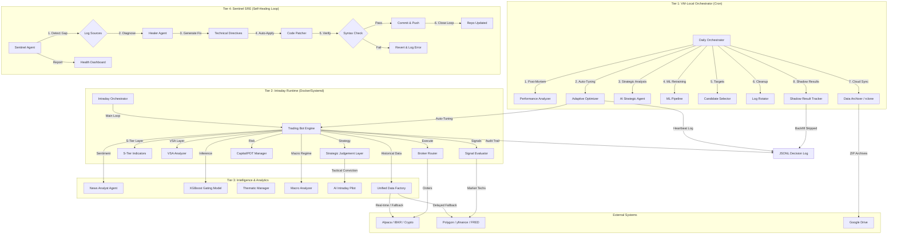

# System Architecture Document

## 1. Overview
The Trading Bot follows a **3-Tier Orchestrated Architecture** designed for high modularity, advanced risk management (Survival Mode), and automated data lifecycle management (Cloud Archiving).

## 2. Component Diagram

```mermaid
graph TB
    subgraph "Tier 1: VM-Local Orchestrator (Cron)"
        A[Daily Orchestrator] -->|1. Post-Mortem| B[Performance Analyzer]
        A -->|2. Auto-Tuning| C[Adaptive Optimizer]
        A -->|3. Strategic Analysis| D[AI Strategic Agent]
        A -->|4. ML Retraining| E[ML Pipeline]
        A -->|5. Targets| F[Candidate Selector]
        A -->|6. Cleanup| G[Log Rotator]
        A -->|7. Cloud Sync| H[Data Archiver / rclone]
        A -->|8. Shadow Results| HR[Shadow Result Tracker]
    end

    subgraph "Tier 4: Sentinel SRE (Self-Healing Loop)"
        W[Sentinel Agent] -->|1. Detect Gap| X{Log Sources}
        X -->|2. Diagnose| Y[Healer Agent]
        Y -->|3. Generate Fix| Y1[Technical Directives]
        Y1 -->|4. Auto-Apply| Y2[Code Patcher]
        Y2 -->|5. Verify| Y3{Syntax Check}
        Y3 -->|Pass| Y4[Commit & Push]
        Y3 -->|Fail| Y5[Revert & Log Error]
        Y4 -->|6. Close Loop| Y6[Repo Updated]
        W -->|Report| Z[Health Dashboard]
    end

    subgraph "Tier 2: Intraday Runtime (Docker/Systemd)"
        I[Intraday Orchestrator] -->|Main Loop| J[Trading Bot Engine]
        J -->|Signals| K[Signal Evaluator]
        J -->|S-Tier Layer| KS[S-Tier Indicators]
        J -->|VSA Layer| KV[VSA Analyzer]
        J -->|Strategy| L[Strategic Judgement Layer]
        J -->|Risk| M[Capital/PDT Manager]
        J -->|Execute| N[Broker Router]
    end

    subgraph "Tier 3: Intelligence & Analytics"
        O[News Analyst Agent]
        P[XGBoost Gating Model]
        Q[Thematic Manager]
        R[Macro Analyzer]
        P1[AI Intraday Pilot]
        DF[Unified Data Factory]
    end

    subgraph "External Systems"
        S[Alpaca / IBKR / Crypto]
        T[Polygon / yfinance / FRED]
        U[Google Drive]
    end

    J -->|Inference| P
    J -->|Sentiment| O
    J -->|Macro Regime| R
    J -->|Historical Data| DF
    DF -->|Real-time / Fallback| S
    DF -->|Delayed Fallback| T
    L -->|Tactical Conviction| P1
    N -->|Orders| S
    K -->|Market Techs| T
    H -->|ZIP Archives| U
    C -->|Auto-Tuning| J
    C -->|Heartbeat Log| V
    J -->|Audit Trail| V[JSONL Decision Log]
    HR -->|Backfill Skipped| V

```

## 3. Data Flows
1.  **Orchestrated Prep (Pull Architecture)**:
    - **Step 1: GHA Trigger (2x Daily)**: GitHub Action (`scheduled-orchestrator.yml`) runs at `06:30` (London Prep + US Post-Mortem) and `12:30` (US Market Prep) UTC. 
    - **Step 2: Trigger VM**: GHA sends a remote SSH trigger to the VM to initiate the full orchestration sequence. GHA no longer performs data harvesting or commits historical data to the repository, significantly reducing CI/CD workload.
    - **Step 3: Harvesting & Execution (VM)**: The VM Orchestrator handles the entire pipeline locally:
        - **Harvesting**: Fetches global market data, updates symbol universe, and refreshes macro/news/earnings context on the VM's disk.
        - **Intelligence Execution**: Performs Post-Mortem, AI Strategic Planning, and ML training/inference.
        - **Freshness**: Maintains strict 3-minute staleness limits for intraday data and 3-hour session limits for candidate discovery.
2.  **Market Execution (T2)**:
    - **Live Learning (Agility)**: `TradingBot` performs `_reload_config()` per loop to pick up Tier 1 optimizations (Adaptive Optimizer) without restart.
    - **Signals**: Bot calculates technindicators and fetches macro regime via `MacroAnalyzer`. It applies the **S-Tier Confluence Layer** (`OrderFlowAnalyzer`, `StructureMonitor`, `VWAPAnalyzer`) to validate entries.
    - **Sizing (Hybrid Conviction)**: `TradingAgent` applies **Tiered Sizing** based on signal strength:
        - **Alpha (1.0x)**: Full S-Tier confluence (POC + BOS + VWAP).
        - **Beta (0.5x)**: Momentum-only breakout (BOS + HH) with flexible VWAP filters.
        - **Normal (0.75x)**: Standard strategic alignment.
    - **Data Unification**: The bot utilizes a **Unified Data Factory** ([data_factory.py](file:///home/gary/rsi-macd-bot/trading_bot/core/data_factory.py)) to fetch historical data. This component centralizes the prioritization of sources (IBKR > Alpaca > YFinance) and ensures consistent timestamp handling and interval mapping across the bot engine and the visual dashboard.
    - **Sizing (Risk)**: `CapitalRiskManager` applies **ADR-driven fee-aware sizing** (MVC). Position cap is $5,000 per trade.
    - **Broker Integration**: US orders route to Alpaca. International orders (.L, .PA, .DE, .HK, .TO) route to IBKR for execution.
    - **Survival**: If `VIX > 40`, the bot enters Survival Mode, blocking new buys. 
    - **Downturn Protection (Phase 5)**: In Bearish/Volatile regimes, the bot automatically:
        - Buys **Protective Puts** to hedge existing long positions.
        - Sells **Covered Calls** for income.
        - Executes **Whitelisted Shorting** on highly liquid symbols (TSLA, NVDA, etc.) to profit from the drop.
    - **Exits**: `ExitEvaluator` consults the **AI Intraday Pilot** (T3) for tactical conviction.
    - **Regional Diversification ("Flex-Control")**: To prevent over-concentration in specific markets (e.g., TSX vs. NYSE), the bot applies a **Confidence Tax** (+0.20 ML threshold) when a region exceeds 40% of the portfolio NAV. This ensures high "Burden of Proof" for over-exposed markets while allowing alpha capture.
    - **Opportunity Cost**: `ShadowResultTracker` (T1) monitors skipped trades in the decision log and backfills real-world outcomes to ensure the ML model can learn from missed opportunities.
3.  **Archiving & Rotation**:
    - Rotated logs and historical CSVs are zipped and shipped to Google Drive monthly via `rclone`.

4.  **Autonomous Healing (T4)**:
    - **Sentinel Agent**: Periodically scans `trading_bot.log`, `orchestrator.log`, and `enhanced_decision_log.jsonl` (specifically auditing for unfilled limit orders via `ShadowResultTracker`).
    - **Strategic Feedback**: Communicates directly with Tier 2 via `sentinel_feedback.json` to force parameter resets or adjust entry confidence floors when stagnation or execution failures are detected.
    - **Healer Agent (Autonomous Repair)**:
        - **Directive Generation**: Translates Sentinel findings into actionable code-level directives.
        - **Auto-Execution Pipeline**: Executes approved directives (`can_auto_apply: true`) automatically during orchestrator runs.
        - **Closed-Loop Repair**: Changes are committed, pushed to the repository, and immediately active on the next run.
        - **Safety Mechanisms**: 
            - Git branch isolation (`healer/auto-fix-{SYMBOL}-{TIMESTAMP}`)
            - Python syntax validation prior to commit
            - Automatic rollback on failures
        - **Audit Trail**: Full traceability from detection to fix in `healer_history.jsonl`.

## 4. Service Boundaries
-   **Broker Router**: Unified interface for Alpaca (US), IBKR (Global), and CCXT (Crypto). 
    - **Robust Identity Layer**: Implements **conId** (IBKR) and **asset_id** (Alpaca) tracking. This provides a "hard-link" to the broker's record, preventing redundant orders if symbol mapping fails.
    - **Normalization**: Normalizes outputs into standard dictionaries. Actively routes orders based on symbol suffix and region. 
    - **Currency Awareness**: Intelligently suffixes international symbols for Dashboards (e.g., `.TO` for CAD, `.L` for GBP) to ensure accurate local pricing and P&L aggregation.
    - **Cluster Prevention**: Automatically cancels pending/stale orders for a symbol before placing a new bracket entry to prevent "Machine Gun" clustering and redundant broker fills.
    - **Execution Persistence (Ghostbuster v1.1.5)**: Automatically logs every fill to `logs/ibkr_fills.jsonl`. Implements a **Zero-Cost Shield** and **Cash-Only Guard** (See [Ghostbuster Protocol](file:///home/gary/rsi-macd-bot/docs/GHOSTBUSTER_PROTOCOL.md) for technical details):
        - **v1.1.4 (Zero-Cost Shield)**: Forces $0.0 P&L for any trade segment missing an opening record in the current session. This ensures "unknown" historical trades result in $0.0 P&L instead of phantom profits.
        - **v1.1.5 (Cash-Only Guard)**: Implements broker-specific liquidity checks. Before placing an international trade, the bot verifies that the **IBKR-specific settled cash** (plus a 1.5x commission buffer) is sufficient to cover the order, ignoring cash in other accounts to prevent margin borrowing.
        - **Session Strictness**: Instantly discards any fill or report that does not match the current UTC calendar day.
        - **Zero-Cost Recovery**: If an execution is reported without a matching session-local opening trade, the system forces a $0.0 P&L by setting the `Avg Entry` == `Avg Exit`. This prevents "100% gain" phantoms from stale broker sessions.
        - **Anomaly Shield**: Validates broker-reported realized P&L by ensuring the reconstructed entry price is within 25% of current market price. High-variance discrepancies are automatically suppressed.
    - **Time-of-Day Awareness**: Autonomously gates execution per local market hours (LSE, TSX, etc.).
-   **Strategic Judgement Layer**: Decoupled module that combines ML scores, news sentiment, and macro bias. Includes **Strict Schema Gating**, **Volume Spread Analysis (VSA)**, and the **S-Tier Confluence Layer** to filter high-probability entries.
-   **Exit Evaluator**: Responsible for same-day and overnight exit logic. Features a **"Grip & Harvest" (ADR Capture)** strategy and the **"The Runner" Protocol**: 
    - **Ultra-Aggressive Entry**: Buy buffers as low as 0.02% to ensure execution.
    - **Dynamic Harvesting**: Targets 75% of the symbol's ADR move for partial profit taking.
    - **"The Runner" Structural Trailing**: After Stage 1 profit lock (+1.5%), the remaining position trails the last **Higher Low (HL)** identified by `StructureMonitor`. This allows capturing parabolic rallies by ignoring shallow retracements that don't break market structure.
    - **Big Bang Caps**: Sets 1.5x ADR limit orders as high-water mark protection.
    - **VSA Integration**: Detects **Buying Climax** and **Volume Divergence** for early profit protection before standard stops trigger.
    - **AI Pilot Integration**: Consults the AI Intraday Pilot for tactical conviction and trailing stop adjustments.
-   **Decision Logger**: Thread-safe JSONL persistence for the "Management Insight" dashboard.
-   **Data Archiver**: Stateless wrapper around `rclone` for cloud synchronization.

## 5. Technology Stack
-   **Language**: Python 3.10+
-   **Infrastructure**: Hetzner Dedicated VM (Linux), Systemd (Process monitoring).
-   **Database**: SQLite (`capital_alloc.db`, `ml_features.db`), JSONL (Decision Audit).
-   **ML Framework**: XGBoost (Gating), Google Gemini 2.0 / google-genai (News/Thematic Analysis, Sentinel Audits, Healer Auto-Repair).
-   **Broker APIs**: Alpaca-py, IBKR Gateway (Portal/API), CCXT.
-   **Utilities**: `rclone` (Cloud Sync), `zip` (Log bundling).

## 6. Deployment Topology
-   **Host**: Linux VM.
-   **Persistence**: Local `data/` and `logs/` volumes with monthly cloud offloading. 
    - **Availability**: Standardized on `rw` (Read-Write) volume mounts across all services to ensure persistence of broker targets, recovery signals, and audit logs.
-   **Monitoring**: Streamlit Dashboard for real-time visibility into the "Brain" (Strategic Judgement).
